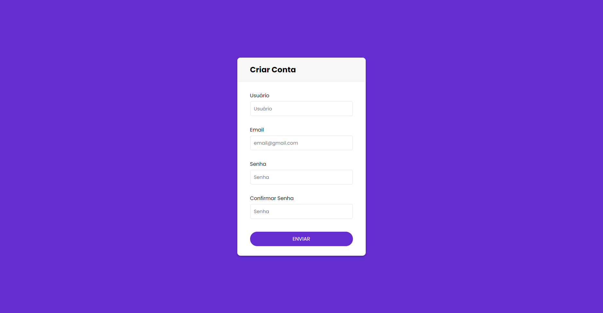

<h1 align="center">Create Account</h1>

## Descrição do Projeto

Este projeto é baseado em uma tela para criar uma conta.

### Features

- [x] Create Account

### Skills

### Inspiração

 O projeto foi inspirado em Code Masters Br</a>

<h1 align="center"> 
	 🚀 Projeto concluído com sucesso... 🚀
</h1>

<h1 align="center" style="font-size: 3rem";>Primeira tela</h1>

